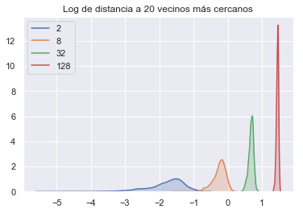
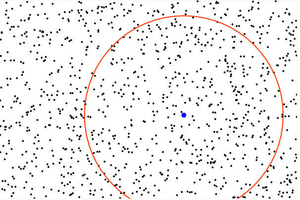
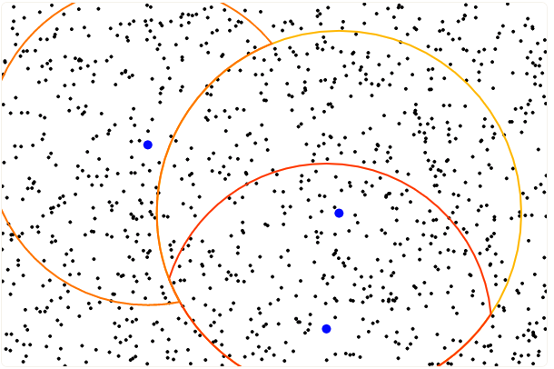
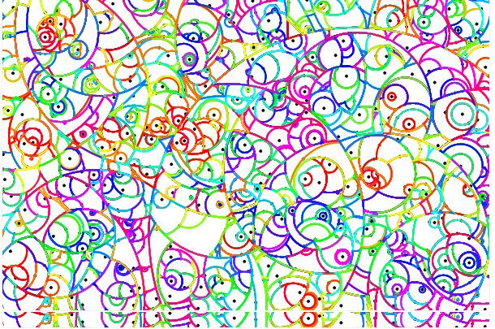
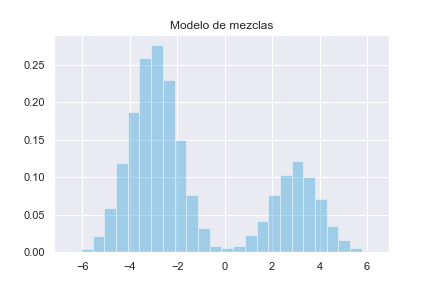

## Introducción

 #### La maldición de la dimensionalidad

 Hacer matemáticas en dimensiones altas es complicado. Richard Bellman (1957) se refirió a las dificultades que surgen cuando en programación dinámica el espacio de estados tiene dimensión grande como *maldición de la dimensionalidad*, pues las posibles respuestas aumentan exponencialmente.  Para poner el problema en contexto estadístico, presentamos dos ejemplos.

 Supongamos que se cuenta con una muestra <img src="https://render.githubusercontent.com/render/math?math=\mathbf{X} \in \mathcal{M}_{n\times p}(\mathbb{R})<img src="https://render.githubusercontent.com/render/math?math=  (<img src="https://render.githubusercontent.com/render/math?math=p<img src="https://render.githubusercontent.com/render/math?math= es muy grande) de puntos distribuidos de manera uniforme en un hipercubo unitario de dimensión <img src="https://render.githubusercontent.com/render/math?math= p<img src="https://render.githubusercontent.com/render/math?math= anclado en el origen, y que sin pérdida de generalidad, interesa estudiar una vecindad del origen. Si localidad se define en el sentido capturar una proporción <img src="https://render.githubusercontent.com/render/math?math=r<img src="https://render.githubusercontent.com/render/math?math= de los puntos cercanos al origen con otro cubo más pequeño, sólo necesitamos determinar la longitud <img src="https://render.githubusercontent.com/render/math?math=L<img src="https://render.githubusercontent.com/render/math?math= de cada arista. Como cada coordenada es uniforme, esto significa que <img src="https://render.githubusercontent.com/render/math?math=r = \mathbb{E}\left[\mathrm{Vol}(\mathrm{cubo})\right]<img src="https://render.githubusercontent.com/render/math?math= y todas son independientes entre sí,  <img src="https://render.githubusercontent.com/render/math?math=r = \mathbb{E}[L^p] = \mathbb{E}^p[L]<img src="https://render.githubusercontent.com/render/math?math=, por lo que en promedio necesitamos aristas de longitud <img src="https://render.githubusercontent.com/render/math?math=r^{1/p}<img src="https://render.githubusercontent.com/render/math?math=. Para visualizar la magnitud de este problema,  basta pensar en la siguiente tabla:

| <img src="https://render.githubusercontent.com/render/math?math=r<img src="https://render.githubusercontent.com/render/math?math= | <img src="https://render.githubusercontent.com/render/math?math=p<img src="https://render.githubusercontent.com/render/math?math= | <img src="https://render.githubusercontent.com/render/math?math=\mathbb{E}[L]<img src="https://render.githubusercontent.com/render/math?math= |
| :----------------------------------------------------------: | :----------------------------------------------------------: | :----------------------------------------------------------: |
|                             0.05                             |                              10                              |                            0.741                             |
|                             0.05                             |                             100                              |                            0.970                             |
|                             0.1                              |                              10                              |                            0.794                             |
|                             0.1                              |                             100                              |                            0.977                             |

  Desde otra perspectiva, supongamos que tenemos una muestra <img src="https://render.githubusercontent.com/render/math?math=\mathbf{X}<img src="https://render.githubusercontent.com/render/math?math= distribuida de manera uniforme en una <img src="https://render.githubusercontent.com/render/math?math=\|\cdot \|_2<img src="https://render.githubusercontent.com/render/math?math=-bola unitaria. Esto ocurre, por ejemplo en un modelo <img src="https://render.githubusercontent.com/render/math?math=X_i \sim \mathcal{N}_p(\mu, \mathbb{I})<img src="https://render.githubusercontent.com/render/math?math=; y sin pérdida de generalidad podemos hacer <img src="https://render.githubusercontent.com/render/math?math=\mu = 0<img src="https://render.githubusercontent.com/render/math?math=.  La distancia de <img src="https://render.githubusercontent.com/render/math?math=\mu<img src="https://render.githubusercontent.com/render/math?math= a su punto más cercano está dada por [2]
 <img src="https://render.githubusercontent.com/render/math?math=<img src="https://render.githubusercontent.com/render/math?math=
 d(p, n) = \left( 1 - \frac{1}{2}^{1/n}\right)^{1/p}
 <img src="https://render.githubusercontent.com/render/math?math=<img src="https://render.githubusercontent.com/render/math?math=
 y llenando datos como arriba vemos que en casos perfectamente factibles como <img src="https://render.githubusercontent.com/render/math?math=n=500<img src="https://render.githubusercontent.com/render/math?math= y <img src="https://render.githubusercontent.com/render/math?math=p=10<img src="https://render.githubusercontent.com/render/math?math=, <img src="https://render.githubusercontent.com/render/math?math=d \approx 0.52<img src="https://render.githubusercontent.com/render/math?math=, por lo que el punto más ceracno al origen está más cerca de la frontera de la región de interés que del origen mismo. Estos problemas disminuyen la efectividad de los métodos no paramétricos en dimensiones altas.

 Como último ejemplo, simulamos en Python puntos uniformes en dimensiones 2, 8, 32 y 128 para comparar las distancias (en logaritmo) a sus vecinos más cercanos.

 

 #### Distintos enfoques 

 Algunos métodos muy populares en reducción de dimensionalidad incorporan la no-linealidad con herramientas topológicas. La *hipótesis de la variedad* supone que los datos <img src="https://render.githubusercontent.com/render/math?math=p<img src="https://render.githubusercontent.com/render/math?math= dimensionales en realidad están una variedad (intuitivamente, un espacio localmente plano) <img src="https://render.githubusercontent.com/render/math?math=q<img src="https://render.githubusercontent.com/render/math?math=  dimensional con <img src="https://render.githubusercontent.com/render/math?math=q\ll p<img src="https://render.githubusercontent.com/render/math?math=.  En una vecindad de cada punto podemos calcular las distancias de manera usual, pero su extensión a la variedad completa tiene que considerar de alguna manera la estructura topológica y en algunos algoritmos la estructura geométrica. Aunque los detalles cambian,  algoritmos como los eigenmapas laplacianos, *locally linear embeddings* y isomap sólo consideran las distancias directas localmente. A diferencia del escalamiento multidimensional que usa una matriz entre todas las observaciones, estos algoritmos la utilizan sólo en una vecindad de cada punto (encontrada, por ejemplo, con kNN) y la extienden usando elementos de teoría de gráficas como caminos más cortos y teoría espectral para aproximar la variedad de manera discreta. ^[1]^ 

 Esta hipótesis no es descabellada en la práctica. Consideremos por ejemplo el famoso dataset MNIST. 

 

 La base completa consiste en 70,000 imágenes de dígitos escritos a mano. De alguna manera sabemos que no hay más que 10 elementos distintos en ese espacio, tal vez rotados y distorsionados según la escritura de cada persona. Esta idea puede formalizarse en una función de coordenadas locales para representar imágenes, precisamente en el lenguaje de las variedades topológicas. 

 En este proyecto presentaremos un algoritmo que preserva la estructura local de los datos para conseguir muy buenos resultados en reducción de dimensionalidad, y discutiermos brevemente un segundo algoritmo que combina la preservación de estructura global y local.	

 ## t-Distributed Stochastic Neighbor Embedding (t-SNE)

 t-SNE es una técnica de visualización desarrollada en 2008 por Laurens Van der Maaten y Geoffrey Hinton que consiste en visualizar datos en altas dimensiones al asignar a cada punto una localización en el espacio euclidiano de 2 o 3 dimensiones. Dicha técnica surge como una mejora a SNE (Stochastic Neighbor Embedding) al tener un gradiente más sencillo de optimizar y que resuelve el *problema de aglutinamiento*. A continuación presentamos t-SNE y la optimización de Barnes-Hut propuesta por el mismo Van der Maaten en el 2014. Esta técnica permite la escalabilidad del algoritmo a conjuntos de datos más grandes. Actualmente t-SNE es considerada como una de las técnicas de *estado del arte* para visualización y reducción de dimensión.

 #### Stochastic Neighbor Embedding (SNE)

 Al igual que en escalamiento multidimensional, en SNE definimos una medida de similaridad. A saber, el vecino más cercano de <img src="https://render.githubusercontent.com/render/math?math=\bold{x}_i<img src="https://render.githubusercontent.com/render/math?math= es el punto <img src="https://render.githubusercontent.com/render/math?math=\bold{x}_j<img src="https://render.githubusercontent.com/render/math?math= con mayor probabilidad bajo una distribución normal  centrada en <img src="https://render.githubusercontent.com/render/math?math=\mathbf{x}_i<img src="https://render.githubusercontent.com/render/math?math= con varianza <img src="https://render.githubusercontent.com/render/math?math=\sigma_i^2\mathbb{I} <img src="https://render.githubusercontent.com/render/math?math=. Como la varianza depende de <img src="https://render.githubusercontent.com/render/math?math=i<img src="https://render.githubusercontent.com/render/math?math=, esta similaridad es asimétrica. Formalmente
 <img src="https://render.githubusercontent.com/render/math?math=<img src="https://render.githubusercontent.com/render/math?math=
 \begin{align}
 p_{j\vert i} &= \frac{\exp\left(-\Vert \bold{x}_i - \bold{x}_j \Vert^2 / 2\sigma_i^2 \right)}{\sum\limits_{k\not=i}\exp\left(-\Vert \bold{x}_i - \bold{x}_k \Vert^2 / 2\sigma_i^2\right)}
 \end{align}
 <img src="https://render.githubusercontent.com/render/math?math=<img src="https://render.githubusercontent.com/render/math?math=
 Y <img src="https://render.githubusercontent.com/render/math?math=p_{i\vert i} = 0<img src="https://render.githubusercontent.com/render/math?math=

 La varianza <img src="https://render.githubusercontent.com/render/math?math=\sigma_i^2<img src="https://render.githubusercontent.com/render/math?math= se calcula determinísticamente a partir de un hiperparámetro especificado por el usuario y de manera que tome valores más pequeños si <img src="https://render.githubusercontent.com/render/math?math=\mathbf{x}_i<img src="https://render.githubusercontent.com/render/math?math= se encuentra en una zona de poca concentración <img src="https://render.githubusercontent.com/render/math?math=\sigma_i<img src="https://render.githubusercontent.com/render/math?math= y valores más grandes si <img src="https://render.githubusercontent.com/render/math?math=\mathbf{x}_i<img src="https://render.githubusercontent.com/render/math?math= se encuentra en una zona de mayor concentración.

 Sea <img src="https://render.githubusercontent.com/render/math?math=P_i<img src="https://render.githubusercontent.com/render/math?math= la distribución de probabilidad condicional sobre las demás observaciones dada <img src="https://render.githubusercontent.com/render/math?math=\mathbf{x}_i<img src="https://render.githubusercontent.com/render/math?math=, *la entropía de Shanon* de <img src="https://render.githubusercontent.com/render/math?math=P_i<img src="https://render.githubusercontent.com/render/math?math= (para más detalles ver apéndice A) es
 <img src="https://render.githubusercontent.com/render/math?math=<img src="https://render.githubusercontent.com/render/math?math=
 H(P_i) := - \sum_j p_{j|i} \log p_{j|i}
 <img src="https://render.githubusercontent.com/render/math?math=<img src="https://render.githubusercontent.com/render/math?math=

 Notemos que cualquier valor de la varianza <img src="https://render.githubusercontent.com/render/math?math=\sigma_i^2<img src="https://render.githubusercontent.com/render/math?math= induce una distribución de probabilidad <img src="https://render.githubusercontent.com/render/math?math=P_i<img src="https://render.githubusercontent.com/render/math?math= cuya entropía <img src="https://render.githubusercontent.com/render/math?math=H(P_i)<img src="https://render.githubusercontent.com/render/math?math= es creciente en <img src="https://render.githubusercontent.com/render/math?math=\sigma^2_i<img src="https://render.githubusercontent.com/render/math?math=. En consecuencia definimos la *perplexity* de <img src="https://render.githubusercontent.com/render/math?math=P_i<img src="https://render.githubusercontent.com/render/math?math= como

 <img src="https://render.githubusercontent.com/render/math?math=<img src="https://render.githubusercontent.com/render/math?math=
 \mathrm{Perp}(P_i) = 2^{H(P_i)}
 <img src="https://render.githubusercontent.com/render/math?math=<img src="https://render.githubusercontent.com/render/math?math=

 Que puede ser interpretada como una medida continua de el número efectivo de vecinos. Así, SNE ejecuta una búsqueda binaria para obtener el valor de <img src="https://render.githubusercontent.com/render/math?math=\sigma_i<img src="https://render.githubusercontent.com/render/math?math= que produce una distribución de probabilidad <img src="https://render.githubusercontent.com/render/math?math=P_i<img src="https://render.githubusercontent.com/render/math?math= con un valor *perplexity* especificado de antemano por el usuario.

 De manera análoga a la construcción de <img src="https://render.githubusercontent.com/render/math?math=p_{j|i}<img src="https://render.githubusercontent.com/render/math?math= podemos obtener la densidad condicional <img src="https://render.githubusercontent.com/render/math?math=q_{j|i}<img src="https://render.githubusercontent.com/render/math?math= de las <img src="https://render.githubusercontent.com/render/math?math=\mathbf{y}_i<img src="https://render.githubusercontent.com/render/math?math= por medio de la siguiente expresión
 <img src="https://render.githubusercontent.com/render/math?math=<img src="https://render.githubusercontent.com/render/math?math=
 q_{j\vert i} = \frac{\exp\left(-\Vert \bold{y}_i - \bold{y}_j \Vert^2 \right)}{\sum\limits_{k\not=i}\exp\left(-\Vert \bold{y}_i - \bold{y}_k \Vert^2 \right)}
 <img src="https://render.githubusercontent.com/render/math?math=<img src="https://render.githubusercontent.com/render/math?math=
 En constraste con <img src="https://render.githubusercontent.com/render/math?math=(1)<img src="https://render.githubusercontent.com/render/math?math= fijamos la varianza de las distribuciones normales correspondientes en <img src="https://render.githubusercontent.com/render/math?math=\frac{1}{\sqrt{2}}<img src="https://render.githubusercontent.com/render/math?math=.

 En caso de que los puntos mapeados <img src="https://render.githubusercontent.com/render/math?math=\mathbf{y}_i<img src="https://render.githubusercontent.com/render/math?math= y <img src="https://render.githubusercontent.com/render/math?math=\mathbf{y}_j<img src="https://render.githubusercontent.com/render/math?math= modelen de forma correcta la similaridad entre las observaciones <img src="https://render.githubusercontent.com/render/math?math=\mathbf{x}_i<img src="https://render.githubusercontent.com/render/math?math= y <img src="https://render.githubusercontent.com/render/math?math=\mathbf{x}_j<img src="https://render.githubusercontent.com/render/math?math= debería tenerse que <img src="https://render.githubusercontent.com/render/math?math=p_{j|i} = q_{j|i}<img src="https://render.githubusercontent.com/render/math?math=. Con base en esta observación, SNE propone minimizar la divergencia de Kullback-Leibler entre las distribuciones condicionales <img src="https://render.githubusercontent.com/render/math?math=P_i<img src="https://render.githubusercontent.com/render/math?math= y <img src="https://render.githubusercontent.com/render/math?math=Q_i<img src="https://render.githubusercontent.com/render/math?math= (para mayor intuición sobre porque la divergencia de KL surge de manera natural en este contexto, visitar el apéndice A). La función costo C está dada por
  \frac{1}{2n} \ \forall i<img src="https://render.githubusercontent.com/render/math?math= de forma que, aún si <img src="https://render.githubusercontent.com/render/math?math=\mathbf{x}_i<img src="https://render.githubusercontent.com/render/math?math= es un outlier la influencia sobre la función objetivo de su <img src="https://render.githubusercontent.com/render/math?math=\mathbf{y}_i<img src="https://render.githubusercontent.com/render/math?math= es significativa. Así pues, si <img src="https://render.githubusercontent.com/render/math?math=P<img src="https://render.githubusercontent.com/render/math?math= y <img src="https://render.githubusercontent.com/render/math?math=Q<img src="https://render.githubusercontent.com/render/math?math=  son las distribuciones conjuntas la función costo es
 <img src="https://render.githubusercontent.com/render/math?math=<img src="https://render.githubusercontent.com/render/math?math=
 C = \sum _i D_{KL} (P \Vert Q) = \sum_i \sum_j p_{ij}\log\frac{p_{ij}}{q_{ij}}
 <img src="https://render.githubusercontent.com/render/math?math=<img src="https://render.githubusercontent.com/render/math?math=
 Cuyo gradiente presenta una forma más sencilla que su contraparte asimétrica.
 <img src="https://render.githubusercontent.com/render/math?math=<img src="https://render.githubusercontent.com/render/math?math=
 \nabla_{y_i} = 4 \sum_{j} (p_{ij} - q_{ij})(\mathbf{y}_i - \bold{y}_j)
 <img src="https://render.githubusercontent.com/render/math?math=<img src="https://render.githubusercontent.com/render/math?math=

 ###### Problema de aglutinamiento

 El problema de aglutinamiento es una consecuencia de la *maldición de la dimensionalidad*, la forma más sencilla de presentarlo para el caso particular que estamos enfrentando es la siguiente. Supongamos que el espacio original está en <img src="https://render.githubusercontent.com/render/math?math=n<img src="https://render.githubusercontent.com/render/math?math= dimensiones y se quiere realizar un mapeo a un espacio de dimensión <img src="https://render.githubusercontent.com/render/math?math=p \ll n<img src="https://render.githubusercontent.com/render/math?math=., notemos que si hay <img src="https://render.githubusercontent.com/render/math?math=n+1<img src="https://render.githubusercontent.com/render/math?math= puntos <img src="https://render.githubusercontent.com/render/math?math=\mathbf{x}_1, ..., \mathbf{x}_{n+1}<img src="https://render.githubusercontent.com/render/math?math= equidistantes entre sí no hay forma de preservar esta propiedad en dimensiones menores a <img src="https://render.githubusercontent.com/render/math?math=n<img src="https://render.githubusercontent.com/render/math?math=.

 En general, dado que el mapeo propuesto por SNE prioriza la preservación de distancias pequeñas, muchos de los puntos que se encuentran a distancias moderadas de <img src="https://render.githubusercontent.com/render/math?math=\mathbf{x}_i<img src="https://render.githubusercontent.com/render/math?math= serán mapeados a puntos que se encuentran distantes de <img src="https://render.githubusercontent.com/render/math?math=\mathbf{y}_i<img src="https://render.githubusercontent.com/render/math?math= pues, como se mencionó en la introducción, una consecuencia de la maldición de la dimensionalidad es que en el espacio bajo-dimensional *tenemos menos espacio*. Todos estos puntos ejercen una fuerza atractiva (pequeña pero considerable) hacia <img src="https://render.githubusercontent.com/render/math?math=\mathbf{y}_i<img src="https://render.githubusercontent.com/render/math?math= que, si se acumula, termina por eliminar los espacios que inicialmente se habían formado entre los clusters naturales de los datos.

 ###### Distribuciones de colas pesadas como solución al desajuste entre distancias

 Para resolver el problema de aglutinamiento, t-SNE propone utilizar una distribución de colas pesadas  en <img src="https://render.githubusercontent.com/render/math?math=\mathbb{R}^q<img src="https://render.githubusercontent.com/render/math?math= de forma que las fuerzas atracticas ocasionadas por la obtención de grandes distancias entre puntos separados moderadamente en el espacio original, puedan ser modeladas en la cola de la distribución.

 En este caso se utiliza una distribución <img src="https://render.githubusercontent.com/render/math?math=t<img src="https://render.githubusercontent.com/render/math?math= con un grado de libertad (una Cauchy)de forma que
 <img src="https://render.githubusercontent.com/render/math?math=<img src="https://render.githubusercontent.com/render/math?math=
 q_{ij} = \frac{(1 + \Vert \mathbf{y}_i - \bold{y}_j \Vert)^{-1}}{\sum\limits_k\sum\limits_{l\not = k}(1 + \Vert \bold{y}_k - y_l \Vert^2)^{-1}}
 <img src="https://render.githubusercontent.com/render/math?math=<img src="https://render.githubusercontent.com/render/math?math=
 Con dicho cambio, el gradiente de la nueva función costo está dado por
 <img src="https://render.githubusercontent.com/render/math?math=<img src="https://render.githubusercontent.com/render/math?math=
 \nabla_{y_i}C = 4\sum_j (p_{ij} - q_{ij})(\mathbf{y}_i - \bold{y}_j) (1 + \Vert \mathbf{y}_i - \bold{y}_j \Vert^2)^{-1}
 <img src="https://render.githubusercontent.com/render/math?math=<img src="https://render.githubusercontent.com/render/math?math=

 Las fuerzas repulsivas en el gradiente de t-SNE son mucho mayores que en el gradiente de SNE obteniendo un proceso más equilibrado (a diferencia del proceso predominantemente atractivo que se genera en SNE). Para un análisis más detallado basado en mecánica de partículas ver [6].

 El proceso de descenso por gradiente es inicializado en <img src="https://render.githubusercontent.com/render/math?math=\mathcal{Y}^0<img src="https://render.githubusercontent.com/render/math?math=, una muestra de una distribución normal con media cero y varianza pequeña. Para acelerar el descenso y para evitar caer en mínimos locales se añade una tasa de aprendizaje, <img src="https://render.githubusercontent.com/render/math?math=\eta<img src="https://render.githubusercontent.com/render/math?math=  y un *momentum*  1<img src="https://render.githubusercontent.com/render/math?math=, tal que las conjuntas <img src="https://render.githubusercontent.com/render/math?math=q_{ij}<img src="https://render.githubusercontent.com/render/math?math= sean pequeñas en comparación con su contraparte <img src="https://render.githubusercontent.com/render/math?math=p_{ij}<img src="https://render.githubusercontent.com/render/math?math=, de esta forma se obliga a que el proceso de optimización de una menor prioridad a las distancias en el mapeo en bajas dimensiones. En consecuencia hay más espacio libre para que los clusters se puedan mover por todo el espacio y para que los datos se organicen de una mejor manera globalmente.

 #### Barnes-Hut-SNE

 Barnes-Hut-SNE es una implementación computacional eficiente de t-SNE propuesta por van der Maaten en [8] que permite reducir la complejidad computacional de t-SNE de <img src="https://render.githubusercontent.com/render/math?math=O(N^2)<img src="https://render.githubusercontent.com/render/math?math= a <img src="https://render.githubusercontent.com/render/math?math=O(N\log N)<img src="https://render.githubusercontent.com/render/math?math=.  Para ello comienza por utilizar una estructura de datos de árboles métricos para aproximar P y posteriormente aproxima los gradientes <img src="https://render.githubusercontent.com/render/math?math=\nabla_{y_i} C <img src="https://render.githubusercontent.com/render/math?math= utilizando el algoritmo de Barnes-Hut.

 ###### Aproximando el cálculo de la similaridad

 Si <img src="https://render.githubusercontent.com/render/math?math=\mathbf{x}_i<img src="https://render.githubusercontent.com/render/math?math= y <img src="https://render.githubusercontent.com/render/math?math=\mathbf{x}_j<img src="https://render.githubusercontent.com/render/math?math= son disimilares (lejanos) <img src="https://render.githubusercontent.com/render/math?math=p_{j \vert i}<img src="https://render.githubusercontent.com/render/math?math= es muy cercano a cero, en consecuencia podemos realizar una aproximación para el cálculo de <img src="https://render.githubusercontent.com/render/math?math=p_{ij}<img src="https://render.githubusercontent.com/render/math?math= definiendo <img src="https://render.githubusercontent.com/render/math?math=p_{j \vert i}<img src="https://render.githubusercontent.com/render/math?math= de la siguiente manera
 <img src="https://render.githubusercontent.com/render/math?math=<img src="https://render.githubusercontent.com/render/math?math=
 p_{j \vert i} = \begin{cases} \frac{\exp\left(-\Vert \bold{x}_i - \bold{x}_j \Vert^2 / 2\sigma_i^2 \right)}{\sum\limits_{k\in\mathcal{N}_i}\exp\left(-\Vert \bold{x}_i - \bold{x}_k \Vert^2 / 2\sigma_i^2\right)} &\quad \text{Si } j \in \mathcal{N_i}  \\ 
 0 &\quad \text{En otro caso}
 \end{cases}
 <img src="https://render.githubusercontent.com/render/math?math=<img src="https://render.githubusercontent.com/render/math?math=
 Donde <img src="https://render.githubusercontent.com/render/math?math=\mathcal{N_i}<img src="https://render.githubusercontent.com/render/math?math= denota los <img src="https://render.githubusercontent.com/render/math?math=\lfloor 3u \rfloor<img src="https://render.githubusercontent.com/render/math?math= vecinos más cercanos a <img src="https://render.githubusercontent.com/render/math?math=\bold{x}_i<img src="https://render.githubusercontent.com/render/math?math= y <img src="https://render.githubusercontent.com/render/math?math=\sigma<img src="https://render.githubusercontent.com/render/math?math= se obtiene de forma que la *perplexity* correspondiente sea <img src="https://render.githubusercontent.com/render/math?math=u<img src="https://render.githubusercontent.com/render/math?math=. Puesto que únicamente consideramos <img src="https://render.githubusercontent.com/render/math?math=\lfloor 3u \rfloor<img src="https://render.githubusercontent.com/render/math?math= observaciones para calcular <img src="https://render.githubusercontent.com/render/math?math=p_{ij}<img src="https://render.githubusercontent.com/render/math?math=, es de esperar que se mejore sustancialmente el tiempo de ejecución del algoritmo. Sin embargo, para ello se supuso que conocemos los vecinos más cercanos para cada observación <img src="https://render.githubusercontent.com/render/math?math=\mathbf{x}_i<img src="https://render.githubusercontent.com/render/math?math=. Pese a que ese no es el caso, existe una estructura de datos que nos permite obtener los <img src="https://render.githubusercontent.com/render/math?math=k<img src="https://render.githubusercontent.com/render/math?math= vecinos más cercanos a <img src="https://render.githubusercontent.com/render/math?math=\mathbf{x}_i<img src="https://render.githubusercontent.com/render/math?math= en <img src="https://render.githubusercontent.com/render/math?math=O(\log N)<img src="https://render.githubusercontent.com/render/math?math=, de forma que podemos encontrar el conjunto de vecinos más cercanos a todas las <img src="https://render.githubusercontent.com/render/math?math=\mathbf{x}_i<img src="https://render.githubusercontent.com/render/math?math=  en <img src="https://render.githubusercontent.com/render/math?math=O(N\log N )<img src="https://render.githubusercontent.com/render/math?math=.

 ###### Árboles Vantage-Point (Árboles VP)

 Los árboles VP son una estructura de datos métrica en la cual cada nodo almacena un objeto, en este caso un punto <img src="https://render.githubusercontent.com/render/math?math=\bold{x}_i<img src="https://render.githubusercontent.com/render/math?math=, y el radio de una bola con centro en dicho punto. El hijo izquierdo de cada nodo almacena todos aquellos puntos que se encuentren dentro de la bola y el hijo derecho almacena todos aquellos puntos que se encuentran fuera de ella . La construcción del árbol toma <img src="https://render.githubusercontent.com/render/math?math=O(N\log N)<img src="https://render.githubusercontent.com/render/math?math= y las búsquedas para obtener los vecinos más cercanos se llevan a cabo en <img src="https://render.githubusercontent.com/render/math?math=O(\log N)<img src="https://render.githubusercontent.com/render/math?math=. A continuación se muestra visualmente el proceso de construcción.

|  |  |  |
| :---------------------------------: | :---------------------------------: | :---------------------------------: |
|          Primera iteración          |          Segunda iteración          |           Iteración final           |

 ######Aproximando el cálculo de el gradiente

 Sea <img src="https://render.githubusercontent.com/render/math?math=Z := (1 + \Vert \mathbf{y}_i - \bold{y}_j \Vert^2)^{-1}<img src="https://render.githubusercontent.com/render/math?math= y recordemos el gradiente de t-SNE para obtener
 <img src="https://render.githubusercontent.com/render/math?math=<img src="https://render.githubusercontent.com/render/math?math=
 \begin{align*}
 \nabla_{y_i}C &= 4\sum_j (p_{ij} - q_{ij})(\mathbf{y}_i - \bold{y}_j) (1 + \Vert \mathbf{y}_i - \bold{y}_j \Vert^2)^{-1} \\
 &= 4 \left( \sum_{j} p_{ij}(\mathbf{y}_i - \bold{y}_j)(1 + \Vert \mathbf{y}_i - \bold{y}_j \Vert^2)^{-1} - \sum_j q_{ij}(\mathbf{y}_i-\bold{y}_j)(1 + \Vert \mathbf{y}_i - \bold{y}_j \Vert^2)^{-1}\right)
 \\
 &= 4 \left( \sum_{j} p_{ij}q_{ij}(\mathbf{y}_i - \bold{y}_j)Z - \sum_j q_{ij}^2(\mathbf{y}_i-\bold{y}_j)Z\right)
 \\
 &= 4 (F_{a} - F_{r} )
 \end{align*}
 <img src="https://render.githubusercontent.com/render/math?math=<img src="https://render.githubusercontent.com/render/math?math=
 <img src="https://render.githubusercontent.com/render/math?math=F_{a}<img src="https://render.githubusercontent.com/render/math?math= denota la suma de todas las fuerzas *atractivas* y su cálculo ya es computacionalmente eficiente y puede obtenerse en <img src="https://render.githubusercontent.com/render/math?math=O(uN)<img src="https://render.githubusercontent.com/render/math?math= tomando en cuenta <img src="https://render.githubusercontent.com/render/math?math=(13)<img src="https://render.githubusercontent.com/render/math?math= y que <img src="https://render.githubusercontent.com/render/math?math=q_{ij}Z<img src="https://render.githubusercontent.com/render/math?math= se puede calcular en <img src="https://render.githubusercontent.com/render/math?math=O(1)<img src="https://render.githubusercontent.com/render/math?math=.

 <img src="https://render.githubusercontent.com/render/math?math=F_r<img src="https://render.githubusercontent.com/render/math?math= denota la suma de fuerzas repulsivas y hasta el momento su cálculo presenta una complejidad de  <img src="https://render.githubusercontent.com/render/math?math=O(N^2)<img src="https://render.githubusercontent.com/render/math?math=, a continuación presentamos el algoritmo de Barnes-Hut que nos permitirá reducir la complejidad de la obtención de <img src="https://render.githubusercontent.com/render/math?math=F_r<img src="https://render.githubusercontent.com/render/math?math= a <img src="https://render.githubusercontent.com/render/math?math=O(N\log N)<img src="https://render.githubusercontent.com/render/math?math=.

 Considérense 3 puntos <img src="https://render.githubusercontent.com/render/math?math=\mathbf{y}_i, \mathbf{y}_j<img src="https://render.githubusercontent.com/render/math?math= y <img src="https://render.githubusercontent.com/render/math?math=\mathbf{y}_k<img src="https://render.githubusercontent.com/render/math?math= donde <img src="https://render.githubusercontent.com/render/math?math=\Vert \mathbf{y}_i - \mathbf{y}_j \Vert \approx \Vert \mathbf{y}_i - \mathbf{y}_k \Vert \gg \Vert \mathbf{y}_j - \mathbf{y}_k \Vert<img src="https://render.githubusercontent.com/render/math?math=. Entonces la diferencia entre las contribuciones de <img src="https://render.githubusercontent.com/render/math?math=\mathbf{y}_k<img src="https://render.githubusercontent.com/render/math?math= y de <img src="https://render.githubusercontent.com/render/math?math=\mathbf{y}_j</iframe>
 ## Clustering y convergencia

 A continuación presentamos un estudio realizado por Linderman y Steinerberger [9] que presenta condiciones ideales sobre los datos asi como requisitos sobre la elección óptima parámetros para asegurar la convergencia y la formación de clusters.

 ###### Recordatorio

 Comencemos por expresar el gradiente de la función costo en de la misma forma que en Barnes-Hut-SNE, en función de fuerzas atractivas y repulsivas.

  1 0  0 \ _\square<img src="https://render.githubusercontent.com/render/math?math=

 ###### Algunos resultados

 En general, <img src="https://render.githubusercontent.com/render/math?math=\beta \sim \frac{hn}{10}<img src="https://render.githubusercontent.com/render/math?math=  es una configuración deseable de parámetros, en particular la combinación canónica elegida por los autores es
 <img src="https://render.githubusercontent.com/render/math?math=<img src="https://render.githubusercontent.com/render/math?math=
 \beta \sim \frac{n}{10} \quad \quad h \sim 1
 <img src="https://render.githubusercontent.com/render/math?math=<img src="https://render.githubusercontent.com/render/math?math=
 Elecciones con dicha configuración conducen a una tasa de convergencia exponencial con tasa <img src="https://render.githubusercontent.com/render/math?math=\kappa<img src="https://render.githubusercontent.com/render/math?math=
 <img src="https://render.githubusercontent.com/render/math?math=<img src="https://render.githubusercontent.com/render/math?math=
 \kappa \sim 1 - \frac{\beta h}{n}
 <img src="https://render.githubusercontent.com/render/math?math=<img src="https://render.githubusercontent.com/render/math?math=
 Notemos que si <img src="https://render.githubusercontent.com/render/math?math=\beta h \geq n <img src="https://render.githubusercontent.com/render/math?math= se rompe la convergencia del algoritmo.

 La elección de parámetros por *regla de dedo* para t-SNE es <img src="https://render.githubusercontent.com/render/math?math=\beta \sim 12<img src="https://render.githubusercontent.com/render/math?math= y <img src="https://render.githubusercontent.com/render/math?math=h \sim 200<img src="https://render.githubusercontent.com/render/math?math=, notemos que para <img src="https://render.githubusercontent.com/render/math?math=n\leq 24000<img src="https://render.githubusercontent.com/render/math?math= cumple con la configuración propuesta, sin embargo, si el número de observaciones es mayor se viola la cota inferior correspondiente desacelerando la convergencia.

 La mejor tasa de convergencia se obtiene con la siguiente selección de parámetros
 <img src="https://render.githubusercontent.com/render/math?math=<img src="https://render.githubusercontent.com/render/math?math=
 \beta h = \frac{9}{10} \left( \sum_{\substack{j \not = i \\\pi(j)= \pi(i)}}p_{ij} \right)^{-1}
 <img src="https://render.githubusercontent.com/render/math?math=<img src="https://render.githubusercontent.com/render/math?math=
 Asimismo, la mejor elección de parámetros que garantiza la mejor convergencia posible de los clusters es
 <img src="https://render.githubusercontent.com/render/math?math=<img src="https://render.githubusercontent.com/render/math?math=
 \beta h = \frac{9}{10} \left( \max_{1\leq i \leq n}\sum_{\substack{j \not = i \\\pi(j)= \pi(i)}}p_{ij} \right)^{-1}
 <img src="https://render.githubusercontent.com/render/math?math=<img src="https://render.githubusercontent.com/render/math?math=

 ## Extensiones

 #### Multiple maps t-SNE

 Las similaridades <img src="https://render.githubusercontent.com/render/math?math=  q_{ij}<img src="https://render.githubusercontent.com/render/math?math=que se usan en t-SNE tienen una limitante que puede pasar desapercibida porque usualmente es algo que queremos: las propiedades de la métrica involucrada. Supongamos por ejemplo que los datos a visualizar son texto, y medimos la similaridad usando asociación entre palabras. Podría ser el caso, por ejemplo, que "lengua" tenga una alta similaridad a "tacos", pero también a "española". En este caso, t-SNE va a colocar a "española" y "tacos" más cerca de lo que en realidad deberían estar. Este efecto es inevitable por la construcción de las <img src="https://render.githubusercontent.com/render/math?math=q_{ij}<img src="https://render.githubusercontent.com/render/math?math=, que utiliza la distancia euclidiana y obliga así, con la desigualdad del triángulo, a tener resultados transitivos.

 Una extensión a t-SNE presentada por van der Maarten y Hinton en [3] construye <img src="https://render.githubusercontent.com/render/math?math=M<img src="https://render.githubusercontent.com/render/math?math=  *mapas*, realizaciones de t-SNE con todas las palabras que asigna a cada punto una importancia. Formalmente, la *importancia* del punto <img src="https://render.githubusercontent.com/render/math?math=\mathbf{x}_ i<img src="https://render.githubusercontent.com/render/math?math= en el mapa <img src="https://render.githubusercontent.com/render/math?math=m<img src="https://render.githubusercontent.com/render/math?math= es <img src="https://render.githubusercontent.com/render/math?math=\pi_i^{(m)}<img src="https://render.githubusercontent.com/render/math?math= con las restricciones <img src="https://render.githubusercontent.com/render/math?math=\forall i \forall m\ \pi_i^{(m)} \geq 0<img src="https://render.githubusercontent.com/render/math?math=  y  <img src="https://render.githubusercontent.com/render/math?math=\sum_m\pi_i^{(m)}=1<img src="https://render.githubusercontent.com/render/math?math=. Las nuevas simiaridades en el espacio pequeño están dadas por
 <img src="https://render.githubusercontent.com/render/math?math=<img src="https://render.githubusercontent.com/render/math?math=
 q_{ij}\propto\sum_m\pi_i^{(m)}\pi_j^{(m)}\left(1+\left\|\mathbf{y}_i^{(m)}-\mathbf{y}_j^{(m)}\right\|^2\right)^{-1}
 <img src="https://render.githubusercontent.com/render/math?math=<img src="https://render.githubusercontent.com/render/math?math=
 con la constante de normalización apropiada para que sumen uno. Al optimizar la divergencia de Kullback-Leibler, ahora se hace con respecto a los puntos <img src="https://render.githubusercontent.com/render/math?math=\mathbf{y}_i^{(m)}<img src="https://render.githubusercontent.com/render/math?math= y los pesos <img src="https://render.githubusercontent.com/render/math?math=\pi_i^{(m)}<img src="https://render.githubusercontent.com/render/math?math= [^1]. Cabe resaltar que el modelo no es un modelo de mezclas con respecto a los mapas, pues en ese caso se usaría un peso por mapa para determinar su importancia; es más bien una mezcla con respecto a las similaridades entre objectos directamente. 

 Este procedimiento permite representar relaciones no transitivas. Por ejemplo, en el caso de "lengua", "taco" y "española", supongamos que hay dos mapas, en ambos las tres palabras están cerca, y los pesos de importancia son

|                                                              | <img src="https://render.githubusercontent.com/render/math?math=x=\mathrm{lengua}<img src="https://render.githubusercontent.com/render/math?math= | <img src="https://render.githubusercontent.com/render/math?math=x=\mathrm{tacos}<img src="https://render.githubusercontent.com/render/math?math= | <img src="https://render.githubusercontent.com/render/math?math=x=\mathrm{espa\tilde nola}<img src="https://render.githubusercontent.com/render/math?math= |
| ------------------------------------------------------------ | ------------------------------------------------------------ | ------------------------------------------------------------ | ------------------------------------------------------------ |
| <img src="https://render.githubusercontent.com/render/math?math=\pi_x^{(1)}<img src="https://render.githubusercontent.com/render/math?math= | <img src="https://render.githubusercontent.com/render/math?math=1/3<img src="https://render.githubusercontent.com/render/math?math= | <img src="https://render.githubusercontent.com/render/math?math=2/3<img src="https://render.githubusercontent.com/render/math?math= | <img src="https://render.githubusercontent.com/render/math?math=0<img src="https://render.githubusercontent.com/render/math?math= |
| <img src="https://render.githubusercontent.com/render/math?math=\pi_x^{(2)}<img src="https://render.githubusercontent.com/render/math?math= | <img src="https://render.githubusercontent.com/render/math?math=1/3<img src="https://render.githubusercontent.com/render/math?math= | <img src="https://render.githubusercontent.com/render/math?math=0<img src="https://render.githubusercontent.com/render/math?math= | <img src="https://render.githubusercontent.com/render/math?math=2/3<img src="https://render.githubusercontent.com/render/math?math= |

 En este caso, la similaridad entre lengua y taco es más o menos (porque estamos suponiendo que los <img src="https://render.githubusercontent.com/render/math?math=\mathbf{y}<img src="https://render.githubusercontent.com/render/math?math= de las tres palabras quedan cerca) <img src="https://render.githubusercontent.com/render/math?math=1/3 \times
 2/3 = 2/9<img src="https://render.githubusercontent.com/render/math?math=, al igual que la similaridad entre lengua y española. Sin embargo, la similaridad entre taco y española es cero.

 Una ventaja más es que podemos representar de mejor manera la centralidad. Recordemos que para tener <img src="https://render.githubusercontent.com/render/math?math=k<img src="https://render.githubusercontent.com/render/math?math= puntos equidistantes en <img src="https://render.githubusercontent.com/render/math?math=\mathbb{R}^p<img src="https://render.githubusercontent.com/render/math?math=, necesitamos <img src="https://render.githubusercontent.com/render/math?math=p\geq k-1<img src="https://render.githubusercontent.com/render/math?math=, por lo que t-SNE no puede representar las situaciones en las que más de tres (en el caso bidimensional) puntos tienen como más cercano a un mismo punto central. La extensión con mapas múltiples lo resuelve de la misma manera, asignando importancias cero en algunos mapas para conseguir que en el conjunto de todos los mapas se represente la centralidad. 

 En la práctica surgen complicaciones como elegir <img src="https://render.githubusercontent.com/render/math?math=M<img src="https://render.githubusercontent.com/render/math?math=, el número de mapas. De manera similar a la elección de <img src="https://render.githubusercontent.com/render/math?math=k<img src="https://render.githubusercontent.com/render/math?math= en kNN,  se puede hacer a través de manera gráfica. Para algún número predeterminado <img src="https://render.githubusercontent.com/render/math?math=M<img src="https://render.githubusercontent.com/render/math?math=, graficamos la razón de preservación de vecindades usando <img src="https://render.githubusercontent.com/render/math?math=m=1, \cdots, M<img src="https://render.githubusercontent.com/render/math?math= mapas, y el comportamiento asintótico de la gráfica (pues eventualmente se capturó ya toda la estructura y no se necesitan más mapas) da un buen punto de corte. 

 ###### Definición 

 La *razón de preservación de vecindades* es 
 <img src="https://render.githubusercontent.com/render/math?math=<img src="https://render.githubusercontent.com/render/math?math=
 \rho(k)=\frac{1}{nk}\sum_{i=1}^n\sum_{\mathbf{y}_j\in\mathcal{N}_k(\mathbf{y}_i)}[\mathbf{x}_j\in\mathcal{N}_k(\mathbf{x}_i)]
 <img src="https://render.githubusercontent.com/render/math?math=<img src="https://render.githubusercontent.com/render/math?math=

 donde <img src="https://render.githubusercontent.com/render/math?math=\mathcal{N}_k(\mathbf{w})<img src="https://render.githubusercontent.com/render/math?math= es el conjunto de los <img src="https://render.githubusercontent.com/render/math?math=k<img src="https://render.githubusercontent.com/render/math?math= vecinos más cercanos a <img src="https://render.githubusercontent.com/render/math?math=\mathbf{w}<img src="https://render.githubusercontent.com/render/math?math=, y <img src="https://render.githubusercontent.com/render/math?math=[P]<img src="https://render.githubusercontent.com/render/math?math= vale uno si <img src="https://render.githubusercontent.com/render/math?math=P<img src="https://render.githubusercontent.com/render/math?math= es cierto o cero si es falso. Es decir, para cada punto  <img src="https://render.githubusercontent.com/render/math?math=i<img src="https://render.githubusercontent.com/render/math?math= se calcula la proporción dentro de sus <img src="https://render.githubusercontent.com/render/math?math=k<img src="https://render.githubusercontent.com/render/math?math= vecinos más cercanos en <img src="https://render.githubusercontent.com/render/math?math=\mathbb{R}^q<img src="https://render.githubusercontent.com/render/math?math= son también vecinos más cercanos en <img src="https://render.githubusercontent.com/render/math?math=\mathbb{R}^p<img src="https://render.githubusercontent.com/render/math?math=.  

 Elegir <img src="https://render.githubusercontent.com/render/math?math=M<img src="https://render.githubusercontent.com/render/math?math= con esta medida corresponde a lo que un usuario haría normalmente: revisar todos los mapas en busca de relaciones significativas entre palabras, y quedarse sólo con las que le aportan algo. 

 Al evaluar t-SNE con mapas múltiples hay que tener en mente la asimetría de la divergencia de Kullback-Leibler presentada en el apéndice A. La optimización no penaliza casos en los que puntos disimlares (con <img src="https://render.githubusercontent.com/render/math?math=p_{ij}<img src="https://render.githubusercontent.com/render/math?math= pequeño) quedan juntos en el mapa (tienen <img src="https://render.githubusercontent.com/render/math?math=q_{ij}<img src="https://render.githubusercontent.com/render/math?math= grande). Esta es una de las diferencias fundamentales entre t-SNE con mapas múltiples y los modelos de tópicos, pues que dos palabras tengan pesos de importancia similares en un mapa no significa que estén relacionadas. 

 Sin embargo, ventajas sobre los modelos de tópicos son que t-SNE con mapas múltiples permite estudiar estructuras y relaciones sutiles entre las palabras que un modelo de tópicos no encontraría y puede entrenarse sólo con una matriz de disimilaridades. 

 En el apéndice C presentamos una corrida de t-SNE con 10 mapas en sobre un conjunto de 100 palabras. 

[^1]: En realidad se entrenan pesos <img src="https://render.githubusercontent.com/render/math?math=w_i^{(m)}<img src="https://render.githubusercontent.com/render/math?math= sin restricciones para usar descenso en gradiente, y después basta usar <img src="https://render.githubusercontent.com/render/math?math=\pi_i^{(m)} \propto e^{-w_i^{(m)}}<img src="https://render.githubusercontent.com/render/math?math=.

 #### t-SNE paramétrico

 Otro problema de t-SNE es que no se extiende a nuevas observaciones. Supongamos que se corrió t-SNE sobre un conjunto de datos <img src="https://render.githubusercontent.com/render/math?math=X \in \mathcal{M}_{n\times p}(\mathbb{R})<img src="https://render.githubusercontent.com/render/math?math= y que recibimos una nueva observación <img src="https://render.githubusercontent.com/render/math?math=\mathbf{x}_{n+1}<img src="https://render.githubusercontent.com/render/math?math=. ¿Cuáles deberían ser sus coordenadas en el nuevo espacio? t-SNE tradicional no da una manera de asignarlo porque es un método no-paramétrico; no hay manera de relacionar una nueva observación porque no estuvo en el proceso inicial. Los métodos paramétricos buscan dar una función explícita <img src="https://render.githubusercontent.com/render/math?math=f_w : \mathbb{R}^p \to \mathbb{R}^q<img src="https://render.githubusercontent.com/render/math?math= en términos del parámetro <img src="https://render.githubusercontent.com/render/math?math=w<img src="https://render.githubusercontent.com/render/math?math= para mapear nuevos puntos.

 Laures van der Maaten propone en [4] una parametrización de t-SNE usando una red neuronal profunda entrenada en partes: primero se preentrena una pila de máquinas de Boltzmann restringidas (modelos gráficos bipartitos completos) como autoencoder (es decir, se entrena una subred para comprimir los datos a una dimensión menor y después reconstruirlos) y después se entrena con backpropagation una red que utiliza la salida del autoencoder como entrada.

 Un método kernelizado fue propuesto por Gisbrecht, Shulz y Hammer en [5]. La función parametrizada toma la forma
 <img src="https://render.githubusercontent.com/render/math?math=<img src="https://render.githubusercontent.com/render/math?math=
 f_w(\mathbf{x}) =\sum_j\mathbf{\alpha}_j\frac{k(\mathbf{x}, \mathbf{x}_j)}{\sum_lk(\mathbf{x}, \mathbf{x}_l)}
 <img src="https://render.githubusercontent.com/render/math?math=<img src="https://render.githubusercontent.com/render/math?math=
 donde <img src="https://render.githubusercontent.com/render/math?math=k(\mathbf{x}, \mathbf{x}_j)=\exp\left(\frac{\|\mathbf{x}-\mathbf{x}_j\|^2}{2\sigma_j^2}\right)<img src="https://render.githubusercontent.com/render/math?math= es el kernel normal y <img src="https://render.githubusercontent.com/render/math?math=\alpha_j\in\mathbb{R}^q<img src="https://render.githubusercontent.com/render/math?math= son parámetros que dependen de los puntos en el espacio <img src="https://render.githubusercontent.com/render/math?math=q<img src="https://render.githubusercontent.com/render/math?math= dimensional. Suponiendo que se corrió t-SNE sobre una muestra original y contamos con el <img src="https://render.githubusercontent.com/render/math?math=<img src="https://render.githubusercontent.com/render/math?math=\mathbf{y}\in\mathbb{R}^p<img src="https://render.githubusercontent.com/render/math?math=<img src="https://render.githubusercontent.com/render/math?math= correspondiente a cada <img src="https://render.githubusercontent.com/render/math?math=\mathbf{x}\in\mathbb{R}^q<img src="https://render.githubusercontent.com/render/math?math=, basta encontrar los <img src="https://render.githubusercontent.com/render/math?math=\mathbf{\alpha}_j<img src="https://render.githubusercontent.com/render/math?math= para tener el mapeo explícitamente.

 ###### Teorema

 Sea <img src="https://render.githubusercontent.com/render/math?math=K\in\mathcal{M}_n(\mathbb{R})<img src="https://render.githubusercontent.com/render/math?math= la matriz con entradas <img src="https://render.githubusercontent.com/render/math?math=(k)_{ij}= k(\mathbf{x}_i, \mathbf{x}_j)/\sum_lk(\mathbf{x}_i, \mathbf{x}_l)<img src="https://render.githubusercontent.com/render/math?math= y <img src="https://render.githubusercontent.com/render/math?math=Y\in\mathcal{M}_{n\times q}(\mathbb{R})<img src="https://render.githubusercontent.com/render/math?math= la matriz con las coordenadas de cada punto en el espacio dimensional por filas. La matriz
 <img src="https://render.githubusercontent.com/render/math?math=<img src="https://render.githubusercontent.com/render/math?math=
 A = K^\dagger Y
 <img src="https://render.githubusercontent.com/render/math?math=<img src="https://render.githubusercontent.com/render/math?math=
 tiene en la fila <img src="https://render.githubusercontent.com/render/math?math=j<img src="https://render.githubusercontent.com/render/math?math= al parámetro <img src="https://render.githubusercontent.com/render/math?math=\mathbf{\alpha}_j \  _\square<img src="https://render.githubusercontent.com/render/math?math=.

 ###### Definición 

 El parámetro <img src="https://render.githubusercontent.com/render/math?math=\sigma_j<img src="https://render.githubusercontent.com/render/math?math= del kernel, llamado *ancho de banda* del kernel. 

 Este resultado indica la manera de extender t-SNE a nuevas observaciones: lo corremos en la muestra inicial, calculamos <img src="https://render.githubusercontent.com/render/math?math=A<img src="https://render.githubusercontent.com/render/math?math= y asignamos cada nueva observación usando <img src="https://render.githubusercontent.com/render/math?math=f_w<img src="https://render.githubusercontent.com/render/math?math=. 

 ###### Teorema

 Si <img src="https://render.githubusercontent.com/render/math?math=\mathbf{x}_j<img src="https://render.githubusercontent.com/render/math?math= es uno de los puntos en la muestra original, 
 <img src="https://render.githubusercontent.com/render/math?math=<img src="https://render.githubusercontent.com/render/math?math=
 \lim_{\sigma_j\rightarrow 0}\mathbf{\alpha}_j=\mathbf{y}_j
 <img src="https://render.githubusercontent.com/render/math?math=<img src="https://render.githubusercontent.com/render/math?math=
 por lo que <img src="https://render.githubusercontent.com/render/math?math=f_w(\mathbf{x}_j)=\mathbf{y}_j \ _\square<img src="https://render.githubusercontent.com/render/math?math=. 

 Los autores recomiendan elegir el ancho de banda <img src="https://render.githubusercontent.com/render/math?math=\sigma_j<img src="https://render.githubusercontent.com/render/math?math= como un múltiplo de la distancia de la observación <img src="https://render.githubusercontent.com/render/math?math=\mathbf{x}_j<img src="https://render.githubusercontent.com/render/math?math= a su vecino más cercano.

 ###### Algoritmo: kernel t-SNE

 aaapseudocode
 class kernel_tsne:
 	def train(x, perplexity, q):
 	""" Entrena t-SNE kernelizado.

 		Parámetros:
-----------
 		x (matriz de nxp):
 			Los datos
 		perplexity (real):
 			Parámetro de t-SNE
 		p (2 o 3):
 			Dimensiones para t-SNE
 	
 		Regresa:
--------
 		(matriz de nxn): 
 			La matriz K explicada arriba.
 		(matriz de nx2):
 			Las coordenadas de los puntos en R^q
 	"""
 		distancias = calcular_distancias_pares(x, x)
 	
 		Y = tsne(distancias, perplexity)
 		sigma = elegir_sigmas(distancias)
 	
 		for all (i,j) in d_planas:
 			K[i,j] = k(x[i], x[j])/sum(k(x[i], x))
 	
 		return (K,Y)
 	
 	def fit(x_nuevas):
 	""" Proyecta puntos nuevos.
 	
 		Suponemos además que se tiene acceso a los puntos usados por el
 		método train como x_viejas y a las matrices K y Y_vieja que arroja.
 	
 		Parámetros:
-----------
 		x_nuevas (matriz de nxp'):
 			Observaciones nuevas.
 		
 		Regresa:
--------
 		(matriz de nxq):
 			Coordenadas de los nuevos puntos.
 			
 			
 	"""
 	
 	distancias = calcular_distancias(x_viejas,x_nuevas)
 	
 	A = pseudoinversa(K)*Y_vieja
 	
 	for all (i,j) in d_planas:
 		K[i,j] = k(x[i], x[j])/sum(k(x[i],x))
 	
 	Y = K*A
 	return Y
 aaa

 #### Reducción de dimensiones supervisada y un poco de geometría

 Hasta ahora nos hemos enfocado en el problema no supervisado de reducción de dimensiones, pero en algunos casos cada punto <img src="https://render.githubusercontent.com/render/math?math=\mathbf{x}_i<img src="https://render.githubusercontent.com/render/math?math= tiene asociada una etiqueta <img src="https://render.githubusercontent.com/render/math?math=g_i<img src="https://render.githubusercontent.com/render/math?math= de entre un número finito <img src="https://render.githubusercontent.com/render/math?math=\mathscr{G}<img src="https://render.githubusercontent.com/render/math?math= de ellas, e interesa encontrar una representación <img src="https://render.githubusercontent.com/render/math?math=\mathbf{y}_i<img src="https://render.githubusercontent.com/render/math?math= que muestre las características relevantes para <img src="https://render.githubusercontent.com/render/math?math=g_i<img src="https://render.githubusercontent.com/render/math?math=. Para ello haremos uso de algunos conceptos de geometría diferencial que introducimos brevemente en el apéndice B.

 Queremos construir una métrica que considere las diferencias entre <img src="https://render.githubusercontent.com/render/math?math=\mathbf{x}<img src="https://render.githubusercontent.com/render/math?math= y sus puntos cercanos sólo según su importancia para <img src="https://render.githubusercontent.com/render/math?math=g<img src="https://render.githubusercontent.com/render/math?math=, por lo que interesa medir cambios en <img src="https://render.githubusercontent.com/render/math?math=p(g|\mathbf{x})<img src="https://render.githubusercontent.com/render/math?math=. Una manera de medir distancia entre distribuciones es la divergencia de Kullback-Leibler, y como se menciona en el apéndice A, la matriz de información de Fisher en el punto <img src="https://render.githubusercontent.com/render/math?math=\mathbf{x}<img src="https://render.githubusercontent.com/render/math?math=
 <img src="https://render.githubusercontent.com/render/math?math=<img src="https://render.githubusercontent.com/render/math?math=
 \mathcal{I}(\mathbf{x})=\mathbb{E}_{p(g|\mathbf{x})}\left[\left(\nabla_x\log p(g|\mathbf{x})\right)\left(\nabla_x\log p(g|\mathbf{x})\right)^\top\right]
 <img src="https://render.githubusercontent.com/render/math?math=<img src="https://render.githubusercontent.com/render/math?math=
 es proporcional a la divergencia de Kullback-Leibler entre <img src="https://render.githubusercontent.com/render/math?math=\mathbf{x}<img src="https://render.githubusercontent.com/render/math?math= y los puntos en una vecindad suya. 

 En cada punto existe entonces una matriz positiva definida <img src="https://render.githubusercontent.com/render/math?math=\mathcal{I}(\mathbf{x})<img src="https://render.githubusercontent.com/render/math?math=  que induce naturalmente el producto interno <img src="https://render.githubusercontent.com/render/math?math=\mathbf{z}^\top\mathcal{I}(\mathbf{x})\mathbf{z}<img src="https://render.githubusercontent.com/render/math?math= en una vecindad de <img src="https://render.githubusercontent.com/render/math?math=\mathbf{x}<img src="https://render.githubusercontent.com/render/math?math=. Intuitivamente, este producto interno escala las dimensiones de <img src="https://render.githubusercontent.com/render/math?math=\mathbf{z}<img src="https://render.githubusercontent.com/render/math?math= en los ejes y proporciones necesarias para <img src="https://render.githubusercontent.com/render/math?math=g<img src="https://render.githubusercontent.com/render/math?math=. Esta matriz induce la métrica de Fisher
 <img src="https://render.githubusercontent.com/render/math?math=<img src="https://render.githubusercontent.com/render/math?math=
 d(\mathbf{x}, \mathbf{x'})=\inf_{\gamma}\int_0^1\|\gamma(t)\|_\mathcal{I}dt
 <img src="https://render.githubusercontent.com/render/math?math=<img src="https://render.githubusercontent.com/render/math?math=
 donde <img src="https://render.githubusercontent.com/render/math?math=\gamma<img src="https://render.githubusercontent.com/render/math?math= es una curva suave con <img src="https://render.githubusercontent.com/render/math?math=\gamma(0)=\mathbf{x}<img src="https://render.githubusercontent.com/render/math?math= y <img src="https://render.githubusercontent.com/render/math?math=\gamma(1) = \mathbf{x}'<img src="https://render.githubusercontent.com/render/math?math=; y <img src="https://render.githubusercontent.com/render/math?math=\|\cdot\|_\mathcal{I}<img src="https://render.githubusercontent.com/render/math?math= es la norma  inducida por el producto interno <img src="https://render.githubusercontent.com/render/math?math=\mathcal{I}(\cdot)<img src="https://render.githubusercontent.com/render/math?math= en ese punto. 

 En la práctica hay que estimar <img src="https://render.githubusercontent.com/render/math?math=p(g|\mathbf{x})<img src="https://render.githubusercontent.com/render/math?math= con los datos y después estimar las integrales de trayectoria.  Referimos a [5] para detalles, pero basta saber que puede hacerse con el estimador no paramétrico de Parzen e integrales sobre rectas. 

 A continuación resumimos el algoritmo, que es muy similar al t-SNE kernelizado original.

 ###### Algoritmo: Fisher kernel t-SNE

 aaapseudocode
 class fisher_kernel_tsne:
 	def train(x, perplexity, q):
 	""" Entrena t-SNE kernelizado con la distancia de Fisher.

 		Parámetros:
-----------
 		x (matriz de nxp):
 			Los datos
 		perplexity (real):
 			Parámetro de t-SNE
 		p (2 o 3):
 			Dimensiones para t-SNE
 	
 		Regresa:
--------
 		(matriz de nxn): 
 			La matriz K explicada arriba.
 		(matriz de nx2):
 			Las coordenadas de los puntos en R^q
 	"""
 		d_fisher = calcular_distancias_fisher_pares(x, x)
 		d_planas = calcular_distancias_pares(x, x)
 	
 		Y = tsne(d_fisher, perplexity)
 		sigma = elegir_sigmas(d_planas)
 	
 		for all (i,j) in d_planas:
 			K[i,j] = k(x[i], x[j])/sum(k(x[i], x))
 	
 		return (K,Y)
 	
 	def fit(x_nuevas):
 	""" Proyecta puntos nuevos.
 	
 		Suponemos además que se tiene acceso a los puntos usados por el
 		método train como x_viejas y a las matrices K y Y_vieja que arroja.
 	
 		Parámetros:
-----------
 		x_nuevas (matriz de nxp'):
 			Observaciones nuevas.
 		
 		Regresa:
--------
 		(matriz de nxq):
 			Coordenadas de los nuevos puntos.
 			
 			
 	"""
 	
 	d_planas = calcular_distancias(x_viejas,x_nuevas)
 	
 	A = pseudoinversa(K)*Y_vieja
 	
 	for all (i,j) in d_planas:
 		K[i,j] = k(x[i], x[j])/sum(k(x[i],x))
 	
 	Y = K*A
 	return Y
 aaa

 Notemos que el proceso geométrico complicado sólo ocurre una vez, y extender a nuevos puntos es computacionalmente menos costoso. 

 ## Conclusión

 En este trabajo presentamos un algoritmo para visualizar datos en dimensiones muy altas, así como sus extensiones para ser más rápido, utilizar datos etiquetados y extenderse a puntos fuera del conjunto de entrenamiento. Mostramos también un caso de uso en MNIST, un conjunto en 784 dimensiones, que el algoritmo separa casi perfectamente. 

 Aunque el análisis de convergencia relaciona t-SNE con métodos de clustering, seguimos a van der Maaten en sugerir que se utilize exclusivamente para visualización en 2 y 3 dimensiones. Para reducción de dimensionalidad en casos más generales, sugerimos utilizar UMAP, un algoritmo más poderoso y más general.

 ## Referencias

 [1] van Der Maaten, L., Postma, E. & van den Herik, J. (2009). Dimensionality reduction: a comparative review. *J Mach Learn Res*, 10, 66-71

 [2] Hastie, T., Tibshirani, R., & Friedman, J. H. (2001). The elements of statistical learning: Data mining, inference, and prediction. New York: Springer.

 [3] van der Maaten, L., & Hinton, G. (2011). Visualizing non-metric similarities in multiple maps. *Machine Learning*, *87*(1), 33-55.  

 [4] van der Maaten, L.. (2009). Learning a Parametric Embedding by Preserving Local Structure. Proceedings of the Twelth International Conference on Artificial Intelligence and Statistics, in PMLR 5:384-391

 [5] Gisbrecht, A., Schulz, A., & Hammer, B. (2015). Parametric nonlinear dimensionality reduction using kernel t-SNE. Neurocomputing, 147, 71–82

 [6] van der Maaten, L., & Hinton, G. (2008). Visualizing Data using t-SNE. *Journal of Machine Learning Research 9 (2008)*, 2579-2605

 [7] Jacobs, R. (1987). Increased Rates of Convergence Through Learning Rate Adaptation. *COINS Technical Report*, 87-117.

 [8] van der Maaten, L. (2013). Barnes-Hut-SNE. arXiv preprint: https://arxiv.org/abs/1301.3342

 [9] Linderman, G. & Steinerberger, S. (2017). Clustering with t-SNE, provably. arXiv preprint: https://arxiv.org/abs/1706.02582

 # Apéndice A: La divergencia de Kullback-Leibler

 Como vimos en el texto principal, la divergencia de Kullback-Leibler  juega un rol importante en la inferencia variacional, pues el problema se reduce a resolver (o al menos aproximar)
 <img src="https://render.githubusercontent.com/render/math?math=<img src="https://render.githubusercontent.com/render/math?math=
 q^* = \arg\min_\mathcal{Q}\{D_{KL}(q||p(\cdot|\mathbf{X}))\}
 <img src="https://render.githubusercontent.com/render/math?math=<img src="https://render.githubusercontent.com/render/math?math=
 En este documento se explora de manera intuitiva la divergencia de Kullback-Leibler desde múltiples perspectivas, incluyendo su primera aparición en el paper que introdujo la *prior* de Jeffreys.

 ## Teoría de la información

 Desde los años treinta, y sobre todo con el advenimiento de la segunda guerra mundial, hubo mucho interés en estudiar criptografía probabilísticamente. En este contexto, la teoría de la información comenzó en 1948 con la publicación de un paper de [Claude Shannon](https://en.wikipedia.org/wiki/Information_theory) titulado *Una teoría matemática de la comunicación*.<img src="https://render.githubusercontent.com/render/math?math=^{[A1]}<img src="https://render.githubusercontent.com/render/math?math= 

 Desde el paper original, Shannon alude a la teoría desarrollada medio siglo antes por Ludwig Boltzmann, de donde toma el término *entropía*. Shannon define la entropía <img src="https://render.githubusercontent.com/render/math?math=H<img src="https://render.githubusercontent.com/render/math?math= de una variable aleatoria discreta con soporte finito y masa <img src="https://render.githubusercontent.com/render/math?math=p<img src="https://render.githubusercontent.com/render/math?math= 
 <img src="https://render.githubusercontent.com/render/math?math=<img src="https://render.githubusercontent.com/render/math?math=
 H(p) = -\sum_xp(x)\log p(x)
 <img src="https://render.githubusercontent.com/render/math?math=<img src="https://render.githubusercontent.com/render/math?math=
 Buscaba en <img src="https://render.githubusercontent.com/render/math?math=H<img src="https://render.githubusercontent.com/render/math?math= una manera de medir qué tan seguros estamos de los valores de una muestra, conociendo su distribución. La idea es aprovechar la estructura <img src="https://render.githubusercontent.com/render/math?math=\sigma<img src="https://render.githubusercontent.com/render/math?math=-aditiva del espacio de probabilidad subyacente para dar información "dual" a la probabilidad: los eventos más raros (de probabilidad más pequeña) deberían dar más información. Puede probarse que la función que resuelve este problema es
 <img src="https://render.githubusercontent.com/render/math?math=<img src="https://render.githubusercontent.com/render/math?math=
 I(x) = \log \left( \frac{1}{p(x)}\right)
 <img src="https://render.githubusercontent.com/render/math?math=<img src="https://render.githubusercontent.com/render/math?math=

 Y con esta notación (que aunque aquí se vea rara, será útil más adelante),
 <img src="https://render.githubusercontent.com/render/math?math=<img src="https://render.githubusercontent.com/render/math?math=
 H(p) = \mathbb{E}[I(X)]
 <img src="https://render.githubusercontent.com/render/math?math=<img src="https://render.githubusercontent.com/render/math?math=
 A <img src="https://render.githubusercontent.com/render/math?math=I<img src="https://render.githubusercontent.com/render/math?math= se le llama *contenido de información*. (Como nota, la base del logaritmo es irrelevante, pero usualmente se toma <img src="https://render.githubusercontent.com/render/math?math=2<img src="https://render.githubusercontent.com/render/math?math= para bits o <img src="https://render.githubusercontent.com/render/math?math=e<img src="https://render.githubusercontent.com/render/math?math= para unidades naturales).

 Algunas observaciones pertinentes:

 1. <img src="https://render.githubusercontent.com/render/math?math=H<img src="https://render.githubusercontent.com/render/math?math= es no negativa
 2. <img src="https://render.githubusercontent.com/render/math?math=H<img src="https://render.githubusercontent.com/render/math?math= es cero si y sólo si   **Teorema**
 >
 >  La regla óptima en el sentido de minimización es asignar  **Observación**
 >
 >  **Observaciones**
 >
 > 1. La divergencia de Kullback-Leibler no es simétrica. Más adalente volvemos a este fenómeno, pero por ahora descartamos la posibilidad de que sea una métrica.
 > 2. Aunque aquí usamos distribuciones discretas, pueden hacerse los cambios usuales para trabajar con variables aleatorias continuas. Formalmente, con variables continuas el término es *entropía diferencial*, y cambia por las tecnicalidades de usar una densidad de probabilidad y no una masa.

 ## Información de discriminación

 La divergencia de Kullback-Leibler también tiene una interpretación en contrastes de hipótesis, y de hecho, Kullback la llamaba por ese nombre<img src="https://render.githubusercontent.com/render/math?math=^{[A3]}<img src="https://render.githubusercontent.com/render/math?math=: *Información de discriminación*.  Fue Trevor Hastie quien popularizó el término "Divergencia de Kullback-Leibler", pero Kullback nunca se refiere a ella así en su libro [A4], de donde tomamos esta exposición.  (De hecho, usa el término *divergencia* para una versión simetrizada de lo que nosotros usamos).

 Supongamos que quieren contrastarse las hipótesis
 <img src="https://render.githubusercontent.com/render/math?math=<img src="https://render.githubusercontent.com/render/math?math=
 H_1: X\sim f_1 \ \ vs. \ H_2: X\sim f_2
 <img src="https://render.githubusercontent.com/render/math?math=<img src="https://render.githubusercontent.com/render/math?math=
 Cuando medimos que <img src="https://render.githubusercontent.com/render/math?math=X=x<img src="https://render.githubusercontent.com/render/math?math=,  del teorema de Bayes,
 <img src="https://render.githubusercontent.com/render/math?math=<img src="https://render.githubusercontent.com/render/math?math=
 \log\frac{f_1(x)}{f_2(x)} = \log \frac{\mathbb{P}(H_1|X=x)}{\mathbb{P}(H_2|X=x)} - \log \frac{\mathbb{P}(H_1)}{\mathbb{P}(H_2)}
 <img src="https://render.githubusercontent.com/render/math?math=<img src="https://render.githubusercontent.com/render/math?math=
 El lado derecho de la expresión de arriba es una medida de la diferencia en información antes y después de considerar <img src="https://render.githubusercontent.com/render/math?math=X=x<img src="https://render.githubusercontent.com/render/math?math=, y al izquierdo, logaritmo del cociente de verosimilitudes lo nombramos *la información para discriminar en favor de* <img src="https://render.githubusercontent.com/render/math?math=H_1<img src="https://render.githubusercontent.com/render/math?math= *y en contra de* <img src="https://render.githubusercontent.com/render/math?math=H_2<img src="https://render.githubusercontent.com/render/math?math=  

 Sea <img src="https://render.githubusercontent.com/render/math?math=F_1<img src="https://render.githubusercontent.com/render/math?math= la distribución de <img src="https://render.githubusercontent.com/render/math?math=X<img src="https://render.githubusercontent.com/render/math?math= bajo <img src="https://render.githubusercontent.com/render/math?math=F_1<img src="https://render.githubusercontent.com/render/math?math=.  Podemos calcular la *información media por observación de <img src="https://render.githubusercontent.com/render/math?math=F_1<img src="https://render.githubusercontent.com/render/math?math= para discriminar en favor de  <img src="https://render.githubusercontent.com/render/math?math=H_1<img src="https://render.githubusercontent.com/render/math?math= y en contra de* <img src="https://render.githubusercontent.com/render/math?math=H_2<img src="https://render.githubusercontent.com/render/math?math=:  
 <img src="https://render.githubusercontent.com/render/math?math=<img src="https://render.githubusercontent.com/render/math?math=
 I(F_1||F_2)=
 \mathbb{E}\left[\log\frac{f_1(x)}{f_2(x)}\right] =
 \int_\mathcal{X}\log\frac{\mathbb{P}(H_1|X=x)}{\mathbb{P}(H_2|X=x)}dF_1 - \log\frac{\mathbb{P}(H_1)}{\mathbb{P}(H_2)}
 <img src="https://render.githubusercontent.com/render/math?math=<img src="https://render.githubusercontent.com/render/math?math=
 Pues
 <img src="https://render.githubusercontent.com/render/math?math=<img src="https://render.githubusercontent.com/render/math?math=
 \int_\mathcal{X}\log\frac{\mathbb{P}(H_1|X=x)}{\mathbb{P}(H_2|X=x)}dF_1 = \int_\mathcal{X}\log\frac{f_1(x)\mathbb{P}(H_1)}{f_2(x)\mathbb{P}(H_2)}dF_1 =
 \int_\mathcal{X}\log\frac{f_1(x)}{f_2(x)}dF_1 + \frac{\mathbb{P}(H_1)}{\mathbb{P}(H_2)}\int_\mathcal{X}dF_1
 <img src="https://render.githubusercontent.com/render/math?math=<img src="https://render.githubusercontent.com/render/math?math=
 Y esto no es otra cosa que <img src="https://render.githubusercontent.com/render/math?math=D_{KL}(F_2||F_1)<img src="https://render.githubusercontent.com/render/math?math=: la divergencia de Kullback-Leibler de <img src="https://render.githubusercontent.com/render/math?math=F_1<img src="https://render.githubusercontent.com/render/math?math= a <img src="https://render.githubusercontent.com/render/math?math=F_2<img src="https://render.githubusercontent.com/render/math?math=. 

 ## Ganancia de información

 En aprendizaje de máquina, la *información ganada sobre* <img src="https://render.githubusercontent.com/render/math?math=X<img src="https://render.githubusercontent.com/render/math?math=  *por observar que* <img src="https://render.githubusercontent.com/render/math?math=A=a<img src="https://render.githubusercontent.com/render/math?math= es
 <img src="https://render.githubusercontent.com/render/math?math=<img src="https://render.githubusercontent.com/render/math?math=
 IG_{X|A}(X,a)=H(F_X)-H(F_x|A=a)
 <img src="https://render.githubusercontent.com/render/math?math=<img src="https://render.githubusercontent.com/render/math?math=
 donde <img src="https://render.githubusercontent.com/render/math?math=H<img src="https://render.githubusercontent.com/render/math?math= es la entropía de Shannon y <img src="https://render.githubusercontent.com/render/math?math=H(\cdot | A)<img src="https://render.githubusercontent.com/render/math?math= es la *entropía condicionada a* <img src="https://render.githubusercontent.com/render/math?math=A<img src="https://render.githubusercontent.com/render/math?math= (que se define de manera muy natural con la formulación de contenido de información: <img src="https://render.githubusercontent.com/render/math?math=\mathbb{E}[I(X)|A=a]<img src="https://render.githubusercontent.com/render/math?math=). Como es de esperar, también hay una conexión rápida a la divergencia de Kullback-Leibler:
 <img src="https://render.githubusercontent.com/render/math?math=<img src="https://render.githubusercontent.com/render/math?math=
 IG_{X|A}(X,a) = D_{KL}(P_X(x|A=a)||P_X(x|I))
 <img src="https://render.githubusercontent.com/render/math?math=<img src="https://render.githubusercontent.com/render/math?math=
 La información ganada es la divergencia de Kullback-Leibler de la *a priori* de X a la posterior de <img src="https://render.githubusercontent.com/render/math?math=X<img src="https://render.githubusercontent.com/render/math?math= dado <img src="https://render.githubusercontent.com/render/math?math=A<img src="https://render.githubusercontent.com/render/math?math=, y mide qué tanta "certidumbre" ganamos . (en forma de información del fenómeno). Claro que esta discusión induce naturalmente la extensión bayesiana.

 En este punto conviene introducir la expresión equivalente
 <img src="https://render.githubusercontent.com/render/math?math=<img src="https://render.githubusercontent.com/render/math?math=
 D_{KL}(p||q) = \mathbb{E}[\log p-\log q]
 <img src="https://render.githubusercontent.com/render/math?math=<img src="https://render.githubusercontent.com/render/math?math=
 y se lee como "los bits de información perdidos, en promedio".

 ##Extensión bayesiana

 Si hacemos <img src="https://render.githubusercontent.com/render/math?math=A=\theta<img src="https://render.githubusercontent.com/render/math?math= con la notación usual de un modelo, estamos midiendo la información que ganamos por usar la posterior y no la *a priori*. Desde otro ángulo, <img src="https://render.githubusercontent.com/render/math?math=D_{KL}(P||Q)<img src="https://render.githubusercontent.com/render/math?math= es la cantidad de información que perdemos por estimar a <img src="https://render.githubusercontent.com/render/math?math=P<img src="https://render.githubusercontent.com/render/math?math=, la verdadera posterior, con <img src="https://render.githubusercontent.com/render/math?math=Q<img src="https://render.githubusercontent.com/render/math?math=. 

 ## Máxima verosimilitud

 También hay un camino frecuentista para construir la divergencia<img src="https://render.githubusercontent.com/render/math?math=^{[A5]}<img src="https://render.githubusercontent.com/render/math?math=. 

 Sea <img src="https://render.githubusercontent.com/render/math?math=\underline{X}_{(n)}<img src="https://render.githubusercontent.com/render/math?math= una muestra aleatoria de <img src="https://render.githubusercontent.com/render/math?math=X\sim q<img src="https://render.githubusercontent.com/render/math?math=, y supóngase que tenemos dos modelos para <img src="https://render.githubusercontent.com/render/math?math=q<img src="https://render.githubusercontent.com/render/math?math=: <img src="https://render.githubusercontent.com/render/math?math=p_0<img src="https://render.githubusercontent.com/render/math?math= y <img src="https://render.githubusercontent.com/render/math?math=p_1<img src="https://render.githubusercontent.com/render/math?math=. La estadística de cociente de verosimilitudes es
 <img src="https://render.githubusercontent.com/render/math?math=<img src="https://render.githubusercontent.com/render/math?math=
 \Lambda = \prod_{i=1}^n\frac{p_1(x_i)}{p_0(x_i)}
 <img src="https://render.githubusercontent.com/render/math?math=<img src="https://render.githubusercontent.com/render/math?math=
 Y para normalizar con respecto al número de observaciones, se toma
 <img src="https://render.githubusercontent.com/render/math?math=<img src="https://render.githubusercontent.com/render/math?math=
 \dot{\Lambda}_n = \frac{1}{n}\sum_{i=1}^n\log\frac{p_1(x_i)}{p_0(x_i)}
 <img src="https://render.githubusercontent.com/render/math?math=<img src="https://render.githubusercontent.com/render/math?math=
 Por la ley fuerte de los grandes números, <img src="https://render.githubusercontent.com/render/math?math=\dot{\Lambda}_n \xrightarrow{c.s} \mathbb{E}[\dot{\Lambda}]<img src="https://render.githubusercontent.com/render/math?math=, donde <img src="https://render.githubusercontent.com/render/math?math=\dot{\Lambda}<img src="https://render.githubusercontent.com/render/math?math= tiene densidad <img src="https://render.githubusercontent.com/render/math?math=f(x) = \log p_1(x)-\log p_0(x)La distancia infinitesimal entre dos puntos en una variedad estadística es, salvo un error de orden cúbico, la diferencia de información entre ellos: su divergencia de Kullback-Leibler.

 La geometría de la información se dedica a estudiar esta conexión entre geometría diferencial y estadística. ¿Por qué suponer que los espacios de parámetros son planos si un modelo puede ser mejor que otro de maneras altamente no lineales? La divergencia de Kullback-Leibler como métrica riemanniana permite optimizar considerando la geometría intrínseca de qué tanto es mejor un modelo con respecto a otros.

 ## Selección de modelos: la información de Akaike

 En un modelo estadístico donde se estiman <img src="https://render.githubusercontent.com/render/math?math=k<img src="https://render.githubusercontent.com/render/math?math=  parámetros a entrenar con una logverosimilitud <img src="https://render.githubusercontent.com/render/math?math=l<img src="https://render.githubusercontent.com/render/math?math=  como función pérdida, el *criterio de información de Akaike*  es 
 <img src="https://render.githubusercontent.com/render/math?math=<img src="https://render.githubusercontent.com/render/math?math=
 \textrm{AIC}=2k-2\ell^*
 <img src="https://render.githubusercontent.com/render/math?math=<img src="https://render.githubusercontent.com/render/math?math=
 donde <img src="https://render.githubusercontent.com/render/math?math=\ell ^*<img src="https://render.githubusercontent.com/render/math?math= es la logverosimilitud evaluada en los estimadores máximoverosímiles de la muestra. El AIC recompensa la bondad de ajuste a través de la logverosimilitud y penaliza la compledijdad a través de <img src="https://render.githubusercontent.com/render/math?math=k<img src="https://render.githubusercontent.com/render/math?math=, pues se elige el modelo con menor AIC.

 Imaginemos que los datos vienen de un proceso <img src="https://render.githubusercontent.com/render/math?math=g<img src="https://render.githubusercontent.com/render/math?math=, y que tenemos una muestra tamaño <img src="https://render.githubusercontent.com/render/math?math=n<img src="https://render.githubusercontent.com/render/math?math=. Queremos estimar a  a <img src="https://render.githubusercontent.com/render/math?math=g<img src="https://render.githubusercontent.com/render/math?math= con un elemento de una familia paramétrica <img src="https://render.githubusercontent.com/render/math?math=\mathcal{F}=\{f_\theta:\theta\in\Theta\}<img src="https://render.githubusercontent.com/render/math?math=. 

 Bajo ciertas condiciones,
 <img src="https://render.githubusercontent.com/render/math?math=<img src="https://render.githubusercontent.com/render/math?math=
 \frac{1}{n}\sum_{i=1}^n\log f_\theta(x_i) \xrightarrow{a.s}S(g;f_\theta) = \mathbb{E}_g[\log f_\theta(X)]
 <img src="https://render.githubusercontent.com/render/math?math=<img src="https://render.githubusercontent.com/render/math?math=
 Como el estimador máximo verosimil alcanza asintóticamente la cota de Cramer y Rao, Akaike propuso medir elegir <img src="https://render.githubusercontent.com/render/math?math=f_\theta<img src="https://render.githubusercontent.com/render/math?math= que mejor aproxime a <img src="https://render.githubusercontent.com/render/math?math=g<img src="https://render.githubusercontent.com/render/math?math= minimizando 
 <img src="https://render.githubusercontent.com/render/math?math=<img src="https://render.githubusercontent.com/render/math?math=
 I(g\ ;f_\theta):=S(g;g)-S(g;f_\theta) = D_{KL}(g||f_\theta)
 <img src="https://render.githubusercontent.com/render/math?math=<img src="https://render.githubusercontent.com/render/math?math=
 La expresión de en medio quiere decir "elegir la <img src="https://render.githubusercontent.com/render/math?math=f_\theta<img src="https://render.githubusercontent.com/render/math?math=  más cercana de <img src="https://render.githubusercontent.com/render/math?math=g<img src="https://render.githubusercontent.com/render/math?math= en logverosimilitud media". Por suerte, conociendo las construcciones anteriores de la divergencia de Kullback-Leibler, tenemos una equivalente: "elegir la la <img src="https://render.githubusercontent.com/render/math?math=f_\theta<img src="https://render.githubusercontent.com/render/math?math= que pierda menos información al representar un proceso que viene de <img src="https://render.githubusercontent.com/render/math?math=g<img src="https://render.githubusercontent.com/render/math?math=".

 Por suerte, no tenemos que conocer <img src="https://render.githubusercontent.com/render/math?math=g<img src="https://render.githubusercontent.com/render/math?math= para elegir a <img src="https://render.githubusercontent.com/render/math?math=f_\theta<img src="https://render.githubusercontent.com/render/math?math=.  Supongamos que <img src="https://render.githubusercontent.com/render/math?math=g=f_{\theta_0}<img src="https://render.githubusercontent.com/render/math?math=.  Usando la interpretación geométrica de la divergencia, sabemos que para <img src="https://render.githubusercontent.com/render/math?math=\theta<img src="https://render.githubusercontent.com/render/math?math= cercanos a <img src="https://render.githubusercontent.com/render/math?math=\theta_0<img src="https://render.githubusercontent.com/render/math?math=, puede aproximarse <img src="https://render.githubusercontent.com/render/math?math=2D_{KL}(f_{\theta_0}||f_{\theta_0+\Delta\theta})\approx\Delta\theta'F\Delta\theta<img src="https://render.githubusercontent.com/render/math?math=, donde <img src="https://render.githubusercontent.com/render/math?math=F<img src="https://render.githubusercontent.com/render/math?math= es la matriz de información de Fisher. En particular, como el estimador máximverosimil es asintóticamente eficiente, sucede cuando <img src="https://render.githubusercontent.com/render/math?math=\theta=\hat\theta_{MV}<img src="https://render.githubusercontent.com/render/math?math=. 

 Supongamos que ahora interesa el mejor <img src="https://render.githubusercontent.com/render/math?math=\theta \in \Upsilon \subseteq \Theta<img src="https://render.githubusercontent.com/render/math?math=, donde <img src="https://render.githubusercontent.com/render/math?math=,\theta_0 \not\in \Upsilon<img src="https://render.githubusercontent.com/render/math?math= y sea <img src="https://render.githubusercontent.com/render/math?math=\hat\theta<img src="https://render.githubusercontent.com/render/math?math= tal estimador. Si <img src="https://render.githubusercontent.com/render/math?math=\dot\theta \in \Upsilon<img src="https://render.githubusercontent.com/render/math?math= maximiza <img src="https://render.githubusercontent.com/render/math?math=S(f_{\theta_0};f_\theta)<img src="https://render.githubusercontent.com/render/math?math= y está suficientemente cerca de <img src="https://render.githubusercontent.com/render/math?math=\hat\theta<img src="https://render.githubusercontent.com/render/math?math=, 
 <img src="https://render.githubusercontent.com/render/math?math=<img src="https://render.githubusercontent.com/render/math?math=
 n(\dot\theta_0-\hat\theta)'F(\dot\theta_0-\hat\theta)\ \dot\sim\ \chi^2_k
 <img src="https://render.githubusercontent.com/render/math?math=<img src="https://render.githubusercontent.com/render/math?math=
 donde <img src="https://render.githubusercontent.com/render/math?math=r=\dim\Upsilon<img src="https://render.githubusercontent.com/render/math?math=.  Se puede probar que 
 <img src="https://render.githubusercontent.com/render/math?math=<img src="https://render.githubusercontent.com/render/math?math=
 \mathbb{E}[2nI(f_{\theta_0};f_{\hat\theta})]= n(\dot\theta-\theta_0)'F(\dot\theta-\theta_0)+k
 <img src="https://render.githubusercontent.com/render/math?math=000<img src="https://render.githubusercontent.com/render/math?math= si es necesario para minimizar la divergencia, por lo que parte de soporte original queda sin modelar. Llamaremos a esta estrategia "forzar ceros".

 A continuación la desarrollamos a partir de un ejemplo. 

 Sea <img src="https://render.githubusercontent.com/render/math?math=\mathbf{X}_{(n)}<img src="https://render.githubusercontent.com/render/math?math= una muestra aleatoria del modelo de mezclas
 <img src="https://render.githubusercontent.com/render/math?math=<img src="https://render.githubusercontent.com/render/math?math=
 Y \sim \textrm{Bernoulli}(0.3) \\
 X|Y=0 ~ \sim \mathcal{N}(-3, 1) \\
 X |Y=1 \sim \mathcal{N}(3,1)
 <img src="https://render.githubusercontent.com/render/math?math=<img src="https://render.githubusercontent.com/render/math?math=
 y sea <img src="https://render.githubusercontent.com/render/math?math=P<img src="https://render.githubusercontent.com/render/math?math= su distribución. 

 

 Supongamos que alguien intenta estimar a <img src="https://render.githubusercontent.com/render/math?math=P<img src="https://render.githubusercontent.com/render/math?math= con una única distribución normal. Por las observaciones de arriba, una manera de cubrir el soporte de  *Explicación:*
 >
 > Una variedad es un espacio localmente plano. Por ejemplo, aunque la tierra sea una esfera no nos damos cuenta a menos que veamos a un horizonte sin estorbos, pues cerca de nosotros parece que vivimos en un mundo plano.

 

 ###### Definición

 Un *mapa de transición* es la composición de una carta  *Explicación:*
 >
 > Los mapas de transición definen homeomorfismos entre abiertos de la variedad. La idea es pasar de la variedad al espacio plano y de ahí regresar a otro abierto en la variedad. 

 

 ###### Definición

 Una variedad es *suave* si todos sus mapas de transición son de clase  *Explicación:*
 >
 > Aunque es posible formalizar el concepto para que no dependa del espacio ambiente, podemos pensar que una variedad  Explicación:
 >
 > En cada punto de la variedad hay un espacio con su producto interno, y si nos movemos a lo largo de la variedad, la transición de un producto interno a otro es suave.

 

 ###### Definición

 El conjunto  Explicación:
 >
 > Para medir la distancia entre dos puntos <img src="https://render.githubusercontent.com/render/math?math=x<img src="https://render.githubusercontent.com/render/math?math= y <img src="https://render.githubusercontent.com/render/math?math=x'<img src="https://render.githubusercontent.com/render/math?math=